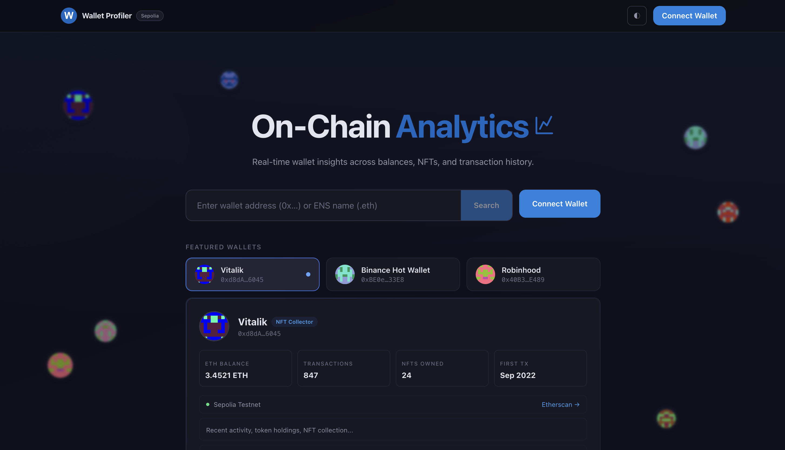
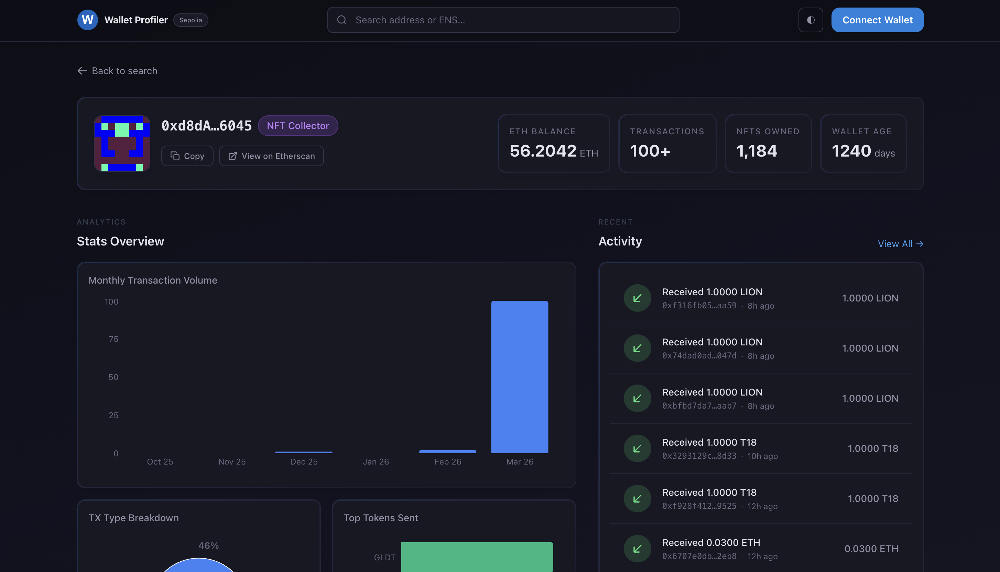
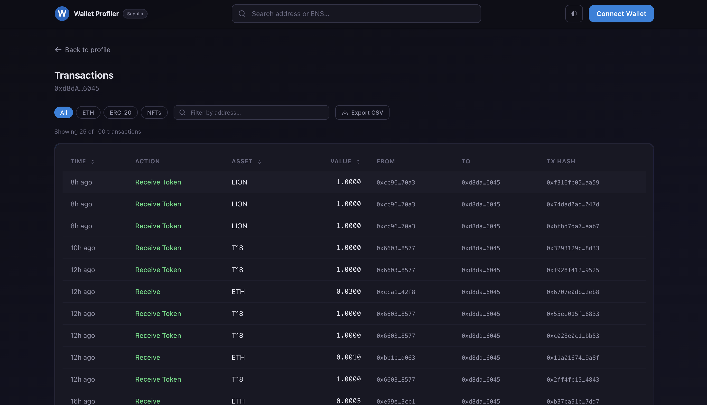
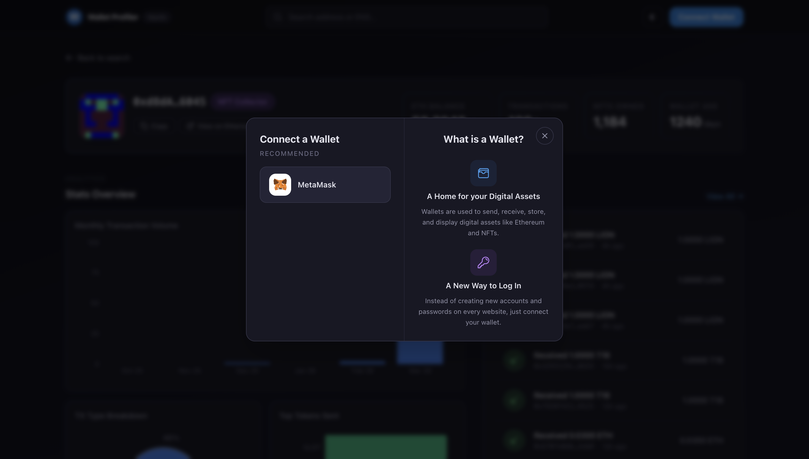
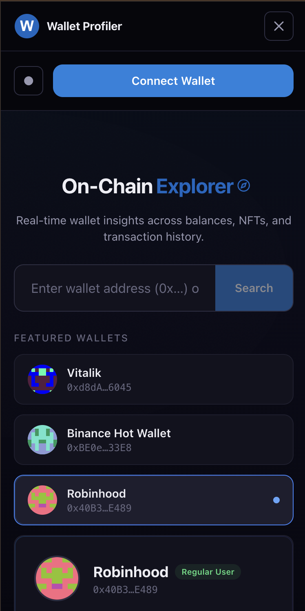

# Wallet Profiler

**Live Demo:** [wallet-profiler-rouge.vercel.app](https://wallet-profiler-rouge.vercel.app)

On-chain activity feed and analytics for any Ethereum wallet. Search any address to explore balances, transactions, NFTs, and personality badges — all powered by live Sepolia testnet data.

## Screenshots

### Home Page


### Wallet Profile


### Transactions Table


### Connect Wallet


### Light Theme — FAQ


### Mobile View


## Features

- **Wallet Profile** — Avatar, ENS name, ETH balance, NFT count, wallet age, and personality badge (Whale, NFT Collector, DeFi Degen, New User)
- **Activity Feed** — Twitter-style transaction feed with color-coded icons, relative timestamps, and Etherscan links
- **Stats Dashboard** — Monthly activity bar chart, TX type breakdown pie chart, top tokens horizontal bar chart
- **Transactions Table** — Sortable columns, category filters (ETH/ERC-20/NFTs), address search, CSV export
- **Wallet Connection** — MetaMask integration with Sepolia auto-switch, auto-redirect to profile
- **Theme Switcher** — Dark / Dim / Light modes with Midnight Galaxy color palette
- **Responsive** — Mobile-first design with card layouts on small screens

## Tech Stack

| Layer | Tool |
|---|---|
| Framework | Next.js 14 (App Router) |
| Styling | Tailwind CSS |
| Blockchain Data | Alchemy SDK (direct JSON-RPC) |
| Ethereum Utils | ethers.js v6 |
| Charts | Recharts |
| Smart Contracts | None — read-only |

## Getting Started

### Prerequisites

- Node.js 18+
- An [Alchemy](https://dashboard.alchemy.com) API key (Ethereum Sepolia)

### Setup

1. Clone the repository:

```bash
git clone https://github.com/tenderdeve/wallet-profiler.git
cd wallet-profiler
```

2. Install dependencies:

```bash
npm install
```

3. Create `.env.local` with your Alchemy API key:

```
ALCHEMY_API_KEY=your_alchemy_api_key_here
NEXT_PUBLIC_CHAIN=eth-sepolia
```

4. Start the dev server:

```bash
npm run dev
```

5. Open [http://localhost:3000](http://localhost:3000)

## Project Structure

```
app/
  page.jsx                        # Home / Search page
  layout.jsx                      # Root layout (Navbar + Footer)
  profile/[address]/
    page.jsx                      # Wallet profile page
    transactions/page.jsx         # Full transactions table
  api/
    alchemy/route.js              # ENS resolution proxy
    transfers/route.js            # Transfers proxy
    wallet/route.js               # Wallet data proxy
components/
  HeroTitle.jsx                   # Animated rotating title
  FloatingWallets.jsx             # Blurred floating wallet avatars
  FeaturedWallets.jsx             # Hover-switchable wallet preview
  SearchBar.jsx                   # Search with ENS resolution
  WalletProfile.jsx               # Profile header + badge + stats
  ActivityFeed.jsx                # Twitter-style TX feed
  StatsDashboard.jsx              # 3 Recharts visualizations
  TransactionsTable.jsx           # Sortable/filterable TX table
  ConnectWallet.jsx               # MetaMask connect modal
  Navbar.jsx                      # Persistent navigation
  Footer.jsx                      # Site footer
  ThemeSwitcher.jsx               # Dark/Dim/Light toggle
  LandingAbout.jsx                # Bento grid features + FAQ
  FaqAccordion.jsx                # Accessible FAQ accordion
  ui/                             # Reusable primitives
hooks/
  useActivityFeed.js              # TX feed data + pagination
  useWalletProfile.js             # Profile data + badge derivation
  useStatsDashboard.js            # Chart data transformation
  useWallet.js                    # MetaMask connection
lib/
  config.js                       # Env var validation
  constants.js                    # Named constants
  utils.js                        # Pure utility functions
  rateLimit.js                    # API rate limiting
  fetchDedup.js                   # Request deduplication
  services/
    transfers.js                  # Alchemy transfers (JSON-RPC)
    wallet.js                     # Balance, TX count, ENS
    nft.js                        # NFT count (REST API)
```

## Security

- API key kept server-side only (no `NEXT_PUBLIC_` prefix)
- All API routes validate inputs with `ethers.isAddress()`
- Rate limiting (30 req/min per IP) on all endpoints
- CSP headers with env-specific config (strict in production)
- Address checksumming, ENS sanitization, TX hash validation
- No `dangerouslySetInnerHTML`, no client-side secrets

## Deployment

Deploy to [Vercel](https://vercel.com):

1. Push to GitHub
2. Import project in Vercel dashboard
3. Set environment variables:
   - `ALCHEMY_API_KEY` — your Alchemy API key
   - `NEXT_PUBLIC_CHAIN` — `eth-sepolia`
4. Deploy

## License

MIT
